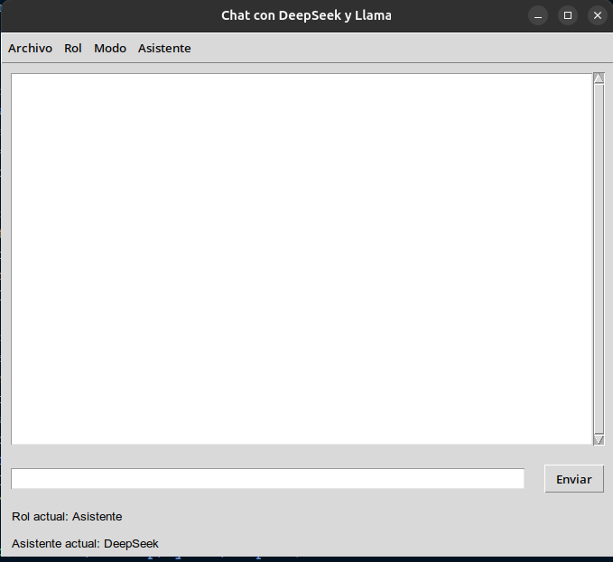

# 🚀 Proyecto: Integración con APIs de LLM (DeepSeek y Llama)

Este proyecto permite interactuar con las APIs de **DeepSeek** y **Llama** para generar respuestas utilizando modelos de lenguaje avanzados. A continuación, se detallan los pasos para configurar y ejecutar el proyecto.

---

## 📋 Requisitos previos

Antes de comenzar, asegúrate de tener lo siguiente:

1. **Claves de API**:
   - Obtén una clave de API de [Llama](https://console.llamaapi.com/en/dashboard).
   - Obtén una clave de API de [DeepSeek](https://platform.deepseek.com/usage).

2. **Python**:
   - Asegúrate de tener Python instalado (versión 3.7 o superior).

---
## 🛠️ Configuración del proyecto

### 1. **Crear el archivo `Api_Keys.py`**
   Crea un archivo llamado `Api_Keys.py` en la raíz del proyecto y añade las claves de API:

   ```python
   # Api_Keys.py
   api_key_deepseek = "Tu_key_API_DeepSeek"
   api_key_llama = "Tu_key_API_Llama"
   ```
---
## 🖥️ Se recomienda usar un .env para instalar las librerias

### 1. **Creamos el entorno virtual:**
        En linux: python3 -m venv nombre_del_entorno
        En Windows: python -m venv nombre_del_entorno

### 2. **Para activarel entorno**
        ```bash
        En linux: source nombre_del_entorno/bin/activate
        En Windows: nombre_del_entorno\Scripts\activate
        ```
        
### 3. **Instalamos los paquetes necesarios**
        ```bash
        pip install openai
        ```
### 4. **Para desactivar el entorno virtual escribimos en ambos SO**
        ```bash
        deactivate
        ```
---
##  🧑‍💻 Interfaz de usuario



>La interfaz es responsive y simple de usar
### **Menu superior**
>Contiene 4 opciones
- **Archivo**
    - **Exportar TXT**
        Al seleccionar estaopcion nos permite exportar toda la conversacion en un txt para su posterior lectura
- **Rol**
    En dicha función, podemos usar roles pre-cargados. Estos roles permiten brindar contexto a la pregunta para que esta sea lo más precisa posible. Por defecto, está programado con 4 roles:

    - **Asistente**:  
    Este es el rol por defecto de todos los asistentes.

    - **Filósofo**:  
    Rol de muestra para preguntas relacionadas con filosofía.

    - **Programador**:  
    Rol de muestra para preguntas relacionadas con programación y tecnología.

    - **Historiador**:  
    Rol de muestra para preguntas relacionadas con historia y eventos pasados.

- **Modo**
    - **Cambiar modo**
    Permite cambiar la interfaz 
    entre blanco y oscuro

- **Asistente**
    Permite cambiar entre las dos IA
    - **DeepSeek**
    - **Llama**
---
### **Menu inferior**
- **Entrada de texto**
    Permite el ingreso de texto
- **Boton Enviar**
    Una vez redactado el mensaje de debe precionar
    este boton para enviar el mensaje

>Debajo de la Entrda de texto
>Se muestra el estado actual del chat
>Rol actual: **muestra el nombre del rol activo**
>Asistente actual: **muestra el nombre de IA activa**

---
##  🔧 Perzonalizar el codigo

### **1. def cambiar_rol(rol):**

### **1.a. Crear nuevos Roles**
    ```python
    roles = {
        "Asistente": "You are a helpful assistant",
        "Filósofo": "Eres un filósofo experto en ética y filosofía moderna.",
        "Programador": "Eres un programador experto en Python y desarrollo de software.",
        "Historiador": "Eres un historiador especializado en la historia del siglo XX.",
    }
    ```
>Vemos que la variable roles es un diccionario donde la calve es el nombre del rol
>y el valor es como se debe comportar. siguiendo dicho formato podemos crear todos los roles que quisieramos

    ```python
    roles = {
        "Asistente": "You are a helpful assistant",
        "Filósofo": "Eres un filósofo experto en ética y filosofía moderna.",
        "Programador": "Eres un programador experto en Python y desarrollo de software.",
        "Historiador": "Eres un historiador especializado en la historia del siglo XX.",
        "Nuevo rol": "Aqui agregamos el tema del cual es 'especialista'",
    }
    ```
> ⚠️ **¡Atención!** 
> Es necesario agregarlo tambien en menu_rol para que asi aparezca el nuevo rol en el menu desplegable
